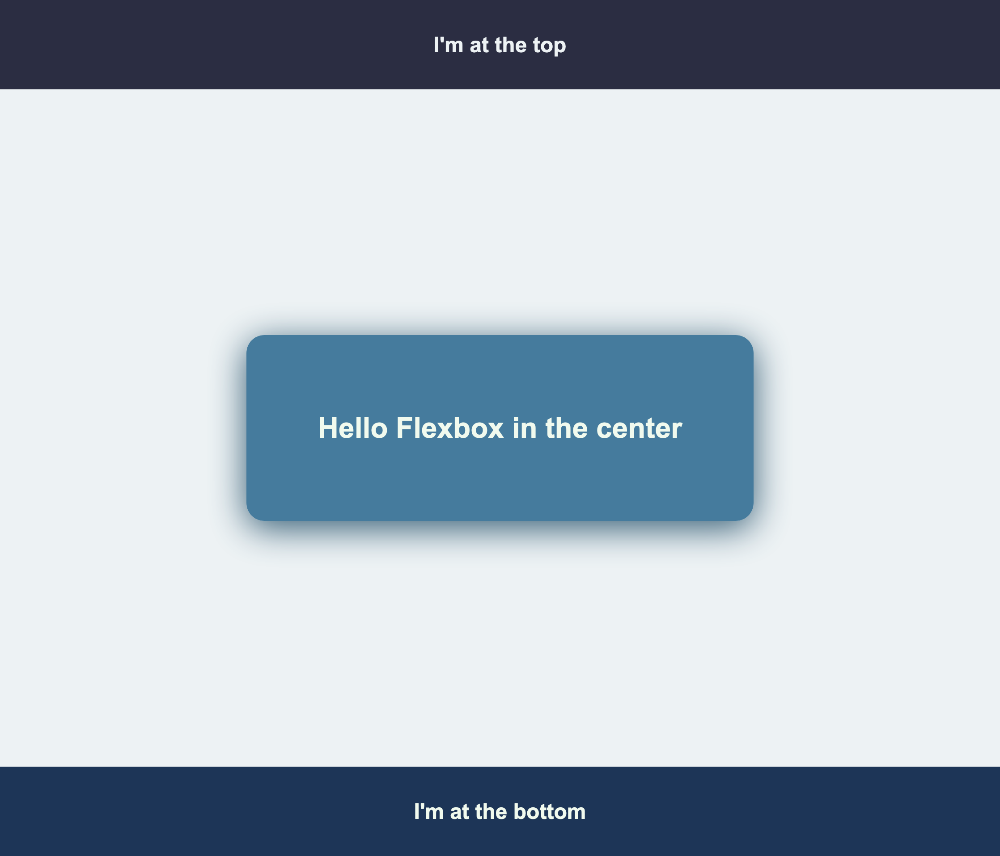
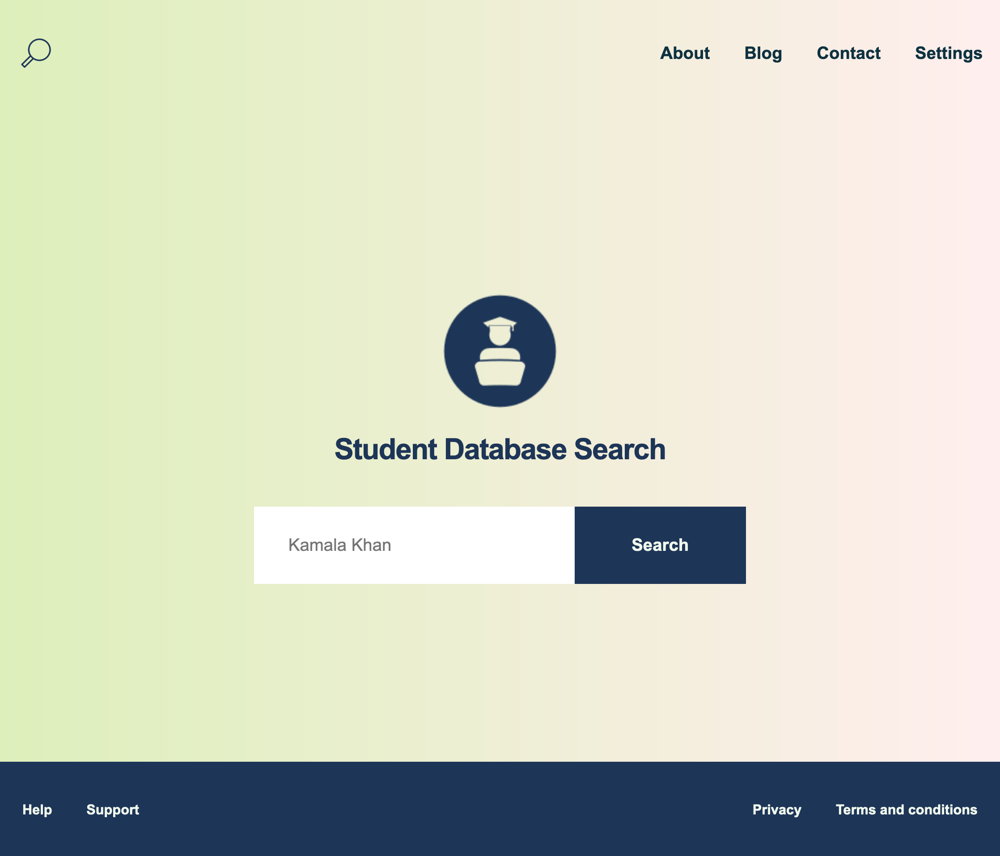

# Tutorial 05

**Course Title**: Web Development

**Course Code**: IRM1005 / ITEC1005

**Semester**: Fall 2023

**Due Date**: n/a

**Assessment**: n/a

## TLDR

1. Let's build a search page
2. There are two seperate steps to this exercise. The first step provides you with practice laying out a page using flexbox. The second step is to build an actual search page. 
3. You will be updating two seperate style sheets to build the two required pages (`style-01.css` and `style-02.css`). 
2. Do not modify any `HTML` for this tutorial exercise.
3. Modify your css files, and commit the changes back to your repo.
2. Turn on GitHub Pages.
3. Submit a comment in the [Tutorial 05 - Show and Tell discussion](https://github.com/orgs/irm1005-itec1005-fall-2023/discussions/9) and share a link to your Search Page live web page.

## Description

The goal of this tutorial is for students to gain even more experience using `Flexbox`, a `CSS` tool that helps us layout elements on our pages.

## Table of contents

- [Instructions](#instructions)
- [Additional Help](#additional-help)
- [Final Solution Screenshots](#screenshots)
- [Helpful Links](#📚-helpful-links)

## Instructions

You must have completed `Tutorial 04` before attempted this exercise. The instructions below assume you have a working developer environment.

To complete this tutorial you must follow the steps below. Additional help can be found further below.

- There are two files that you are going to modify in this exercise, `style-01.css` `style-02.css`.
- You do not need to modify any `HTML` for this tutorial exercise.
- Using the final solution screenshots as a reference, follow the instructions in each `CSS` file to acheive the desired results.
- `style-01.css` is a simple practice exercises to get you started with using `Flexbox` to do page layouts.
- If you get stuck, you can use the example in the `solutions` folder for guidance.
- Preview your pages using the LivePreview (or similiar) feature in VSCode.
- Commit your changes and push to GitHub.
- Turn on [GitHub Pages](https://github.com/orgs/irm1005-itec1005-fall-2023/discussions/4) in the `settings` section of your repository.
- View your live web pages.
- In the [Tutorial 05 - Show and Tell discussion](https://github.com/orgs/irm1005-itec1005-fall-2023/discussions/9) in our GitHub Discussion Group, add a comment with a link to your Search Page.
- Check out some of your other team members Navigation Bars and make sure to tell them how awesome they are.

## Additional help

### Cloning your tutorial repository

Refer to the Birghtspace videos `Setting up all the things` for instructions on how to setup your local development environment and clone your tutorial repository so that you can work on your code locally.

### Activating GitHub pages

Refer to this [discussion post](https://github.com/orgs/irm1005-itec1005-fall-2023/discussions/4) for instructions on how to turn on the GitHub Pages service for your repository.

## Screenshots

### Image of Step 01

### Image of Step 02

You are encouraged to bring in your own text styles, logo, colours, anything to make it unique. The screenshot below is just for reference. 

## 📚 Helpful links

### Flexbox

- [A guide to flexbox](https://css-tricks.com/snippets/css/a-guide-to-flexbox/)
- [Flexbox cheatsheet](https://yoksel.github.io/flex-cheatsheet/)
- [Flexbox Froggy Game](https://flexboxfroggy.com/)
- [Another flexbox cheatsheet](https://www.sketchingwithcss.com/samplechapter/cheatsheet.html)
- [Article on flexbox sizing](https://www.smashingmagazine.com/2018/09/flexbox-sizing-flexible-box/)
- [Intro to CSS - Prof3ssorSt3v3](https://www.youtube.com/watch?v=KFKScNHa-8M&list=PLyuRouwmQCjl4wTSNbb8RTKZuyMhoIxBe)
- [CSS Tutorial - MDN](https://developer.mozilla.org/en-US/docs/Web/CSS)

### GitHub

- [A short video explaining what GitHub is](https://www.youtube.com/watch?v=w3jLJU7DT5E&feature=youtu.be)
- [Git and GitHub learning resources](https://docs.github.com/en/github/getting-started-with-github/git-and-github-learning-resources)
- [Understanding the GitHub flow](https://guides.github.com/introduction/flow/)
- [How to use GitHub branches](https://www.youtube.com/watch?v=H5GJfcp3p4Q&feature=youtu.be)
- [GitHub's Learning Lab](https://lab.github.com/)
- [Education community forum](https://education.github.community/)
- [GitHub community forum](https://github.community/)

### Git

- [Interactive Git training materials](https://githubtraining.github.io/training-manual/#/01_getting_ready_for_class)
